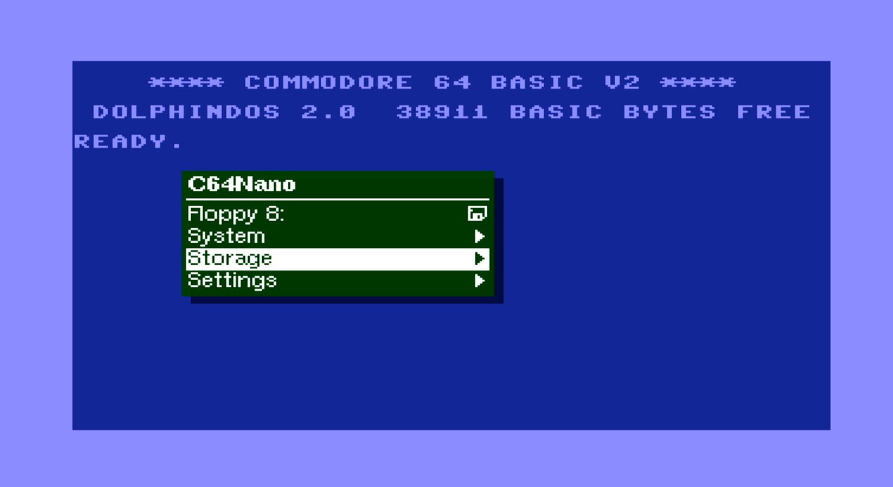

# C64Nano

The C64Nano is a port of some [MiST](https://github.com/mist-devel/mist-board/wiki) and
[MiSTer](https://mister-devel.github.io/MkDocs_MiSTer/) core components for the
[C64](https://en.wikipedia.org/wiki/Commodore_64):

| Board      | FPGA       | support |Note|
| ---        |        -   | -     |-|
| [Tang Nano 20k](https://wiki.sipeed.com/nano20k)     | [GW2AR](https://www.gowinsemi.com/en/product/detail/38/)  | HDMI / LCD |Dualshock or 2nd D9 Joystick via MiSTeryShield20k spare header|
| [Tang Primer 25K](https://wiki.sipeed.com/hardware/en/tang/tang-primer-25k/primer-25k.html) | [GW5A-25](https://www.gowinsemi.com/en/product/detail/60/) | HDMI |no Dualshock, no Retro D9 Joystick, no MIDI |
| [Tang Mega NEO 60k Dock](https://wiki.sipeed.com/hardware/en/tang/tang-mega-60k/mega-60k.html) | [GW5AT-60](https://www.gowinsemi.com/en/product/detail/60/) | HDMI / LCD | twin Dualshock |
| [Tang Mega 138k Pro](https://wiki.sipeed.com/hardware/en/tang/tang-mega-138k/mega-138k-pro.html)|[GW5AST-138](https://www.gowinsemi.com/en/product/detail/60/) | HDMI / LCD |twin Dualshock |
| [Tang Console 60K NEO](https://wiki.sipeed.com/hardware/en/tang/tang-console/mega-console.html)|[GW5AT-60](https://www.gowinsemi.com/en/product/detail/60/) | HDMI / LCD |twin Dualshock, no Retro D9 Joystick|
| [Tang Console 138K NEO](https://wiki.sipeed.com/hardware/en/tang/tang-console/mega-console.html)|[GW5AST-138](https://www.gowinsemi.com/en/product/detail/60/)|HDMI / LCD |twin Dualshock, no Retro D9 Joystick|

This project relies on a MPU being connected to the FPGA. --> [MiSTle-Dev wiki](https://github.com/MiSTle-Dev/.github/wiki) <--  

> [!NOTE]
> If you don't need the WIFI modem on a TN20K then even the onboard BL616 MPU can be used. WIFI modem is supported on M0S Dock, Console 60K / 138k and Mega 60k Dock too (requires I-PEX MHF4 connector antenna)

Original C64 core by Peter Wendrich and c1541 by [darfpga](https://github.com/darfpga).  
All HID components and MPU firmware by Till Harbaum

Features:

* support of Core load from FLASH or USB pendrive (Console SDcard + USB)
* PAL 720x576p@50Hz or NTSC 720x480p@60Hz HDMI Video and Audio Output
* TFT-LCD module 800x600 [SH500Q01Z](https://dl.sipeed.com/Accessories/LCD/500Q01Z-00%20spec.pdf) + Speaker support
* USB Keyboard
* [USB Joystick](https://en.wikipedia.org/wiki/Joystick) or [USB Gamepad](https://en.wikipedia.org/wiki/Gamepad)
* [USB Mouse](https://en.wikipedia.org/wiki/Computer_mouse) as [c1351](https://en.wikipedia.org/wiki/Commodore_1351) Mouse emulation
* [USB Gamepad](https://en.wikipedia.org/wiki/Gamepad) Stick as [Paddle](https://www.c64-wiki.com/wiki/Paddle) Emulation
* [USB XBOX 360 Controller](https://en.wikipedia.org/wiki/Xbox_360_controller) as Joystick or Paddle
* 2 x [legacy D9 Joystick](https://en.wikipedia.org/wiki/Atari_CX40_joystick) (Atari / Commodore digital type)
* Joystick emulation on Keyboard Numpad
* Emulation of [C64GS Cheetah Annihilator](https://en.wikipedia.org/wiki/Commodore_64_Games_System) Joystick 2nd Trigger Button (Pot X/Y)
* emulated [1541 Diskdrive](https://en.wikipedia.org/wiki/Commodore_1541) on FAT/extFAT microSD card with parallel bus [Speedloader Dolphin DOS 2](https://rr.pokefinder.org/wiki/Dolphin_DOS). [GER manual](https://www.c64-wiki.de/wiki/Dolphin_DOS)
* C1541 DOS ROM selection
* Cartridge ROM (*.CRT) loader
* Direct BASIC program (*.PRG) injection loader
* Tape (*.TAP) image loader as [C1530 Datasette](https://en.wikipedia.org/wiki/Commodore_Datasette)
* Loadable 8K Kernal ROM (*.BIN)
* REU (*.reu) image loader
* [VIC-II](https://en.wikipedia.org/wiki/MOS_Technology_VIC-II) revision and [6526](https://en.wikipedia.org/wiki/MOS_Technology_CIA) / 8521 selection
* [SID](https://en.wikipedia.org/wiki/MOS_Technology_6581) revision 6581 or 8580 selectable
* 2nd dual SID Option and loadable Filter curves
* emulated [RAM Expansion Unit (REU)](https://en.wikipedia.org/wiki/Commodore_REU) or [GeoRAM](https://en.wikipedia.org/wiki/GeoRAM)
* On Screen Display (OSD) for configuration and loadable image selection (D64/G64/CRT/PRG/BIN/TAP/FLT)
* Physical MIDI-IN and OUT
* RS232 Serial Interface [VIC-1011](http://www.zimmers.net/cbmpics/xother.html) or [UP9600](https://www.pagetable.com/?p=1656) mode to Tang onboard USB-C serial port or external hw pin.
* Swiftlink-232 [6551](https://en.wikipedia.org/wiki/MOS_Technology_6551) WIFI Modem Interface to FPGA-Companion up to 38400 Baud
* Freezer support (e.g. Action Replay)
* external IEC device (C1541 Floppy / IEC Printer etc.)
* DigiMax four channel audio DAC ($DE00 /$DF00)
* [EasyFlash](https://www.c64-wiki.com/wiki/EasyFlash) CRT Save (for enhanced Games that support write to [Flash](https://skoe.de/easyflash/) as gameplay progress storage)



## Installation

The installation of C64 Nano on the Tang Nano 20k board can be done using a Linux PC or a Windows PC
[(Instruction)](INSTALLATION_WINDOWS.md).

## c64 Nano on Tang Primer 25K

See [Tang Primer 25K](TANG_PRIMER_25K.md). PMOD TF-CARD V2 is required !

## c64 Nano on Tang Mega NEO 60k Dock

See [Tang Mega 60K NEO](TANG_MEGA_60K.md)

## c64 Nano on Tang Mega 138k Pro

See [Tang Mega 138K Pro](TANG_MEGA_138Kpro.md)

## c64 Nano on Tang Console 60k / 138k NEO

See [Tang Console 60K / 138k NEO](TANG_CONSOLE_60K.md)

## c64 Nano with LCD and Speaker

See [Tang Nano LCD](TANG_NANO_20k_LCD.md)

## emulated Diskdrive c1541

Emulated 1541 on a regular FAT/exFAT formatted microSD card including parallel bus Speedloader Dolphin DOS 2.0.
Add D64 or G64 images as you like and insert card in TN slot. LED 0 acts as Drive activity indicator.

> [!TIP]
> Disk directory listing: [(or F7 keypress)](https://project64.c64.org/hw/dolphindos.txt)  
> command:  
> LOAD"$",8  
> LIST  
> Load first program from Disk: (or just LOAD if Dolphin Kernal active)  
> LOAD"*",8  
> RUN  

C1541 DOS ROM can be selected from OSD (default Dolphin DOS 2.0, CBM DOS, SpeedDos Plus or JiffyDOS)
In case a program don't load correctly select via OSD the factory default CBM DOS an give it a try.

## Cartridge ROM Loader (.CRT)

Cartridge ROM can be loaded via OSD file selection.  
Also EasyFlash save game progress images are loaded via this item.

> [!TIP]
> **Detach Cartridge** by OSD:
> ```temporary``` **Cartridge unload & Reset** ```permanent``` **No Disk**, **Save settings** and System **Cold Boot**

> [!IMPORTANT]
> Be aware that some Freezer Card CRT might require to use the standard C64 Kernal and the standard C1541 CBM DOS.

## EasyFlash Cartridge Save (.CRT)

Saving game progress for **EasyFlash** [cartridge ](https://gitlab.com/easyflash/) images is now the de facto standard.
Progress is written directly into the `*.CRT` file, so the image is modified in place (rewritten). It is strongly recommended to keep a backup copy in case the file becomes corrupted.

**Workflow:**

1. Load your game via **CRT ROM:** as usual, for example `caren_priorart_ef.crt` or any other EasyFlash-enabled game.
2. Perform the **in-game** save-to-CRT process (this is game-specific). The game will program selected blocks of the two emulated AM29F040B flash chips to store progress.
3. Press **Save EZFLASH:**. The core writes the updated EasyFlash image, including the modified save blocks, back to the SD card (for example as `caren_priorart_ef.crt`).

To **resume** a saved game, load it again via **CRT ROM:** and use the in-game load/continue function.

> [!IMPORTANT]
> Some games that support flash writes require the standard C64 Kernal and standard C1541 CBM DOS.

This feature behaves differently than on MiSTer: MiSTer rewrites the CRT image in Linux userspace and creates a different file. Here, the rewrite is done directly by the Mistle C64 core in HDL, and the original CRT file is overwritten.

## BASIC Program Loader (.PRG)

A BASIC Program *.PRG file can be loaded via OSD file selection.  Auto RUN after load can be disabled via OSD.

## Tape Image Loader (*.TAP)

A [Tape](https://en.wikipedia.org/wiki/Commodore_Datasette) *.TAP file can be loaded via OSD file selection
In order to start a tape download choose C64 CBM Kernal (mandatory as Dolphin DOS doesn't support Tape). Best to save Kernal OSD selection via **Save settings**.
> [!IMPORTANT]
> command: **LOAD**  
> ___ Only if you have [Exbasic Level II](https://www.c64-wiki.de/index.php?title=Exbasic_Level_II&oldid=261004). CRT Basic loaded then use command: 
> **LOAD***  
> Screen will blank!

The file is loaded automatically as soon as TAP file selected via OSD (no need to press PLAY TAPE button) in case ***no** TAP had been previously selected*.
As mentioned screen will blank for several seconds and then display briefly the filename of the to be loaded file. It will blank shortly afterwards again till load completed and take a lot of time...
For **Tape unload** use OSD TAP selection **No Disk** and **Reset** or System **Cold Boot**
> [!WARNING]
> After board power-up or coldboot a TAP file will **not autoloaded** even if TAP file selection had been saved or c64tap.tap mountpoint available !
> Unblock loader by OSD TAP selection **No Disk** or simply select again the desired TAP file to be loaded after you typed **LOAD**

> [!TIP]
> Check loaded file by command: **LIST**

> [!IMPORTANT]
> command: **RUN**

> [!NOTE]
> The available (muffled) Tape Sound audio can be disabled from OSD.

## Kernal Loader (.BIN)

The build-in Dolphin Kernal is the power-up default C64 Kernal with an excellent C1541 speedloader.

In general Kernal ROM files *.BIN can be loaded via OSD selection.
Copy a 8K C64 Kernal ROM .BIN to your sdcard and rename it to **c64kernal.bin** as default boot Kernal.
Prevent Kernal load by OSD Kernal BIN selection **No Disk** and **Save settings** and do a **power-cyle** of the board. In this case the build-in Dolphin Kernal will by default be used after next power cycle.

## SID Filter Curve (.FLT)

Custom filter curves can optionally be loaded via OSD.

> [!TIP]
> In most cases this is not required, because the built-in filter curves are already well optimized.

> [!NOTE]
> Remember to select the 6581 chip, not the 8580.
> Select `Custom 1` as the filter to activate it. When a custom filter is loaded, there is no difference between `Custom 1`, `Custom 2`, and `Custom 3`. Select `Default` to switch back to the built-in filter curve.

Filter examples and references:
https://www.telnetbbsguide.com/bbs/software/image-bbs/

To disable filter-curve loading, set OSD Kernal **FLT** to **No Disk**, select **Save settings**, and power-cycle the board.

## Ram Expansion Unit (.REU)

Ram Expansion Unit images can optionally be loaded via OSD.

## Core Loader Sequencing

The core will after power cycle/ cold-boot start downloading the images on the sdcard in the following order:

> [!NOTE]
> (1) BIN Kernal, (2) CRT ROM, (3) PRG Basic and finally (4) FLT.

## emulated RAM Expansion Unit REU 1750

For those programs the require a [RAM Expansion Unit (REU)](https://en.wikipedia.org/wiki/Commodore_REU) it can be activated by OSD on demand.  
TN20k supports 512k and 2MByte size whereas Primer, Mega and Console do support also 16MB.

Playing [Sonic the Hedgehog V1.2](https://csdb.dk/release/?id=212523)
Enable REU, and load the PRG.  
Playing around with [GEOS](https://en.wikipedia.org/wiki/GEOS_(8-bit_operating_system))
Enable REU, select c1541 CBM DOS ROM and load the PRG.

## external IEC device

Use of an external IEC device e.g. C1541 / Printer and support of a selectable D9 Joystick port for hw interfacing is mutually exclusive.  

> [!NOTE]
> Best to use C64 stock Kernal as starting point but also Dolphin DOS was able to read directoy when both drives are active. External C1541 is typically factory configured for drive address #8.  
> Tang internal C1541 emulation also use by default address #8 so you need to change it via OSD to #9 so that there are no address conflicts. Internal drive becomes now #9 and external one #8.  

In case MiSTeryShieldRpPico20k **J3 spare** connector is used for interfacing then a 5V level shifter / open collector driver is needed.  
BiDir level shifter like: [Converter](https://github.com/venice1200/MiSTer_SNAC2IEC/tree/main/Schematics) based on commercial available I2C level shifter PCBA, Transistor circuit or [TI TXS104E / TXS108E](https://www.ti.com/product/TXS0108E) should be usable.  

D9 Joystick port **#1**  
No level shifter is needed as already available on the MiSTeryShield board (for 5V Joystick interfacing).

D9 Port **#1**

| FPGA | TN20k | Signal   | D9 |any ShieldPico| DualShock| IEC      |
|------|-------|----------|----|-------------|----------|----------|
| 27   | J4‑8  | io(0)    | 6  | BTN1        | DS2_CLK  | CLK (4)  |
| 28   | J4‑9  | io(1)    | 2  | DOWN        | DS_MOSI  | DATA (5) |
| 25   | J4‑10 | io(2)    | 1  | UP          | DS_MISO  | RESET (6)|
| 26   | J4‑11 | io(3)    | 4  | RIGHT       | DS2_CS   | ATN (3)  |
| 29   | J4‑12 | io(4)    | 3  | LEFT        | –        | –        |
| 30   | J4‑13 | io(5)    | 9  | BTN2        | –        | –        |
| --   | J4‑20 | GND      | 8  | GND         | –        | GND (2)  |
| --   | J7‑1  | 5V       | 7  | 5V          | –        | –        |

D9 Port **#2** (or spare header J3 MiSTeryShieldPiPico)  
Only MiSTeryShieldRpPico20k-dualD9 port has two D9 ports.  

> [!IMPORTANT]
> Connecting a IEC device to spare header J3 without level shifter will for sure damage the FPGA!

| FPGA | TN20k | Signal   | D9 |ShieldPico *dual D9*| ShieldPico J3 | DualShock| IEC     |
|------|-------|----------|----|-------------|-------------|----------|---------|
| 73   | J4‑1  | spare(0) | 6  | BTN1        | 1           | DS2_CLK  |CLK (4)  |
| 74   | J4‑2  | spare(1) | 2  | DOWN        | 2           | DS_MOSI  |DATA (5) |
| 77   | J4‑5  | spare(2) | 1  | UP          | 3           | DS_MISO  |RESET (6)|
| 31   | J4‑14 | spare(3) | 4  | RIGHT       | 4           | DS2_CS   |ATN (3)  |
| 49   | J7‑12 | spare(4) | 3  | LEFT        | 5           | –        |         |
| 52   | J7‑20 | spare(5) | 9  | BTN2        | –           | –        | –       |
| --   | J4‑20 | GND      | 8  | GND         | 6           | –        | GND (2) |
| --   | J4‑19 | 3V3      | –  | –           | 7           | –        | –       |
| --   | J7‑1  | 5V       | 7  | 5V          | 8           | –        | –       |

**Cable** side !

| Pin | Name   | Description        |
|-----|--------|--------------------|
| 1   | /SRQIN | Serial SRQIN       |
| 2   | GND    | Ground             |
| 3   | ATN    | Serial ATN In/Out  |
| 4   | CLK    | Serial CLK In/Out  |
| 5   | DATA   | Serial DATA In/Out |
| 6   | /RESET | Reset              |

 

## Push Button utilization

* S1 open OSD

* S2 Reset

## OSD

invoke by F12 keypress

## Gamecontrol support

<u>legacy D9 Digital Joystick.</u>  

OSD: **Retro D9 1**
Atari ST type of Joystick 2nd button supported using a MiSTeryNano shield buildin D9 connector.  
Don't configure e.g. [ArcadeR](https://retroradionics.com) for C64 mode rather than normal digital 2nd button mode (2nd trigger button connect signal to ground)

OSD: **Retro D9 2**
Atari ST type of Joystick 2nd button supported using the MiSTeryNano shield **spare J8 connector header and extra wiring.** [->> wiki](https://github.com/MiSTle-Dev/.github/wiki/Classic-Joysticks)  
Don't configure e.g. [ArcadeR](https://retroradionics.com) for C64 mode rather than normal digital 2nd button mode (2nd trigger button connect signal to ground)

<u>USB Joystick(s)</u>.  
OSD: **USB #1 Joy** or **USB #2 Joy**
Also [RII Mini Keyboard i8](http://www.riitek.com/product/220.html) left Multimedia Keys are active if **USB #1 Joy** selected.

<u>Keyboard Numpad.</u>  
OSD: **Numpad**

|Numpad| |Numpad|
|-|-|-|
|0  Trigger|8  Up|.  Trigger 2|
|4  Left|-|6  Right|
|-|2  Down|-|

<u>Mouse.</u>  
OSD: **Mouse**
USB Mouse as c1351 Mouse emulation.

<u>USB Paddle</u>.  
OSD: **USB #1 Padd** or **USB #2 Padd**
Left Stick in X / Y analog mode as VC-1312 Paddle emulation.
Button **cross / square** as Trigger

## Keyboard

 
 PAGE UP (Tape Play) Key or the Tang S1 Button swap the Joystick Ports if OSD **Swap Joys** is set to Off mode.

 
 F2,F4,F6,F8,Left/Up keys automatically activate Shift key.  
 F9 - arrow-up key.  
 F10 - = key.  
 F11 (RESTORE) Key as ``FREEZE``. Typically used by Freezer Cards like Action Replay, Snappy Rom etc.  
 F12 OSD  
 Alt,Tab - C= key.  

## LED UI

| LED | function    | TN20K | TP25K |TM60K|TM138K Pro|Console60K/138k|
| --- |           - | -     | -     | -   |-         |-|
| 0 | c1541 activity| x     | x     | x   |x         |x|
| 1 | EZFlash save  | x     | x     | x   |x         |x|

Solid **<font color="red">red</font>** of the c1541 led after power-up indicates a missing DOS in Flash

## Multicolor RGB LED

* **<font color="green">green</font>**&ensp;&thinsp;&ensp;&thinsp;&ensp;&thinsp;all fine and ready to go
* **<font color="red">red</font>**&ensp;&thinsp;&ensp;&thinsp;&ensp;&thinsp;&ensp;&thinsp;&ensp;&thinsp;something wrong with SDcard / default boot image
* **<font color="blue">blue</font>**&ensp;&thinsp;&ensp;&thinsp;&ensp;&thinsp;&ensp;&thinsp;MPU firmware detected valid FPGA core
* **<font color="yellow">yellow</font>**&ensp;&thinsp;&ensp;&thinsp;&ensp;&thinsp;FPGA core can't detect valid firmware
* **white**&ensp;&thinsp;&ensp;&thinsp;&ensp;&thinsp;-

## MIDI-IN and OUT

Type of MIDI interface can be selected from OSD. There is support for Sequential Inc., Passport/Sentech, DATEL/SIEL/JMS/C-LAB and Namesoft. You can use a [MiSTeryNano shield](https://github.com/harbaum/MiSTeryNano/tree/main/board/misteryshield20k/README.md) to interface to a Keyboard.
Note: Enabling persitent the MIDI interface will block other things like Multicard CRT ROMS.

## RS232 Serial Interface Swiftlink-232 <-> WIFI Modem

Have a look: [Wiki WIFI Modem](https://github.com/MiSTle-Dev/.github/wiki)  

Most Terminal programs need the Kernal serial routines therefore select via OSD the CBM Kernal rather than default DolphinDOS.  
In addition select OSD System RS232 mode ``Swiftlink DE``. Also possible ACIA [6551](https://en.wikipedia.org/wiki/MOS_Technology_6551) addresses are: $DE00 (default), $DF00 or $D700.  

> [!NOTE]
> Don't forget to active the ``PETSCII`` character input mode if you are sending commands to the modem !

For a PETSCII or ASCII/ANSI BBS you can use [ccgms](https://github.com/mist64/ccgmsterm).  
Press ``F8`` and select modem ``Swiftlink DE`` and Baudrate of ``38400``.  
You can press ``Shift F8`` to toggle in between the different character [modes](https://github.com/mist64/ccgmsterm/blob/main/Documentation.md).  
Connect to you WIFI AP and have a try: ``ATD`` [bbs.retrocampus.com:6510](https://bbs.retrocampus.com) or just have a look at [telnetbbsguide](https://www.telnetbbsguide.com/bbs/software/image-bbs) and choose as you like.  

For a more exotic Turbo56k protocol BBS use [retroterm](https://github.com/retrocomputacion/retroterm).  

Note: Enabling persitent the Swiftlink-232 ACIA 6551 component at $FE00 will block other things like Multicard CRT ROMS. Adress $D700 doesn't block other HW.

## RS232 Serial Interface VIC-1011/UP9600 <-> USB-C / external HW pins

The Tang onboard USB-C serial port can be used for communication with the C64 Userport Serial port in [VIC-1011](http://www.zimmers.net/cbmpics/xother.html) or [UP9600](https://www.pagetable.com/?p=1656) mode. Terminal programs need the Kernal serial routines therefore select via OSD the CBM Kernal rather than default DolphinDOS. For a first start use UP9600 mode and a Terminal program like [ccgms](https://github.com/mist64/ccgmsterm) and on the PC side [Putty](https://www.putty.org) with 2400 Baud.

OSD selection allows to change in between TANG USB-C port or external HW pin interface.

| Board      |RX (I) FPGA |TX (O) FPGA|Note|
|  -         |   -    |   -  | -   |
| TN20k      |75      | 76   | |
| TP25k      |K5      | L5   | J4-6  J4-5, share M0S Dock PMOD|
| TM60k NEO  |AB20    | AA19 | J24-6 J24-5, share M0S Dock PMOD |
| TM138k Pro |H15     | H14  | J24-6 J24-5, share M0S Dock PMOD |

Remember that in + out to be crossed to connect to external device. Level are 3V3 tolerant.

## Pinmap D-SUB 9 Joystick Interface

* Joystick interface is 3.3V tolerant. Joystick 5V supply pin has to be left floating !


|Joystick pin|IO   |Tang Nano pin| FPGA pin |Joystick Function|
|----------- |-----| ---         | -------- |-----            |
| 1          |2    | J6 10       | 25       | UP              |
| 2          |1    | J6 9        | 28       | DOWN            |
| 3          |4    | J6 12       | 29       | LEFT            |
| 4          |3    | J5 11       | 26       | RIGHT           |
| 5          |-    | -           | -        | POT Y/ TRIGGER 3|
| 6          |0    | J5 8        | 27       | TRIGGER         |
| 7          |-    | n.c         | n.c      | 5V              |
| 8          |-    | J5 20       | -        | GND             |
| 9          |-    | -           | 30       | TRIGGER 2       |


## Getting started


[Board Setup](https://github.com/MiSTle-Dev/.github/wiki/Board-Setup)


