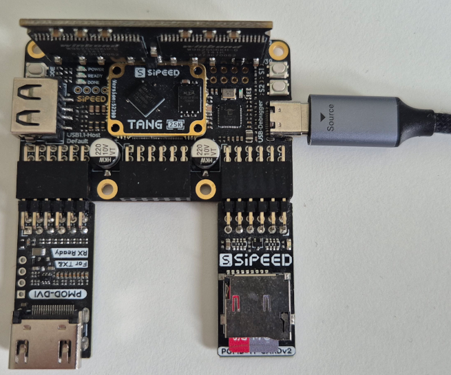

# C64 Nano on Tang Primer 25K

C64 Nano can be used in the [Tang Primer 25K](https://wiki.sipeed.com/hardware/en/tang/tang-primer-25k/primer-25k.html).  
Unlike the TN20K, the TP25k's FPGA does not come with an internal SDRAM. Nor does the board come with HDMI or an SD card slot.

* 32MB SDRAM can be added in the form of the [Tang SDRAM](https://wiki.sipeed.com/hardware/en/tang/tang-PMOD/FPGA_PMOD.html#TANG_SDRAM)  
* HDMI can be added via the [PMOD DVI](https://wiki.sipeed.com/hardware/en/tang/tang-PMOD/FPGA_PMOD.html#PMOD_DVI)  
* SD card is installed using the [PMOD TF-CARD V2](https://wiki.sipeed.com/hardware/en/tang/tang-PMOD/FPGA_PMOD.html#PMOD_TF-CARD).  

All three add-ons need to carefully be mounted with the SDRAM's "THIS SIDE FACES OUTWARD" pointing to the boards edge. The HDMI needs to be mounted to the leftmost PMOD slot andf the SD card to the rightmost.

This core variant only supports **onboard BL616 MPU** to free a PMOD for retro D9 Joystick / ext IEC drive use.
Middle PMOD is reserved as digital input with needed level shifters for D9 Joystck and IEC drive. MIDI RX, TX can be accessed via the USB-A connector and needs Optocoupler like in the MiSTeryShield. Pinmap can be found from .cst file.

TP25k allows to make use of all core feature due to slight increased FPGA size compared to TN20k.

The whole setup will look like this:  

On the software side the setup is very simuilar to the original Tang Nano 20K based solution. The core needs to be built specifically
for the different FPGA of the Tang Primer using either the [TCL script with the GoWin command line interface](build_tp25k.tcl) or the
[project file for the graphical GoWin IDE](tang_primer_25k_c64.gprj). The resulting bitstream is flashed to the TP25K as usual. So are the c1541 DOS ROMs which are flashed exactly like they are on the Tang Nano 20K. 
